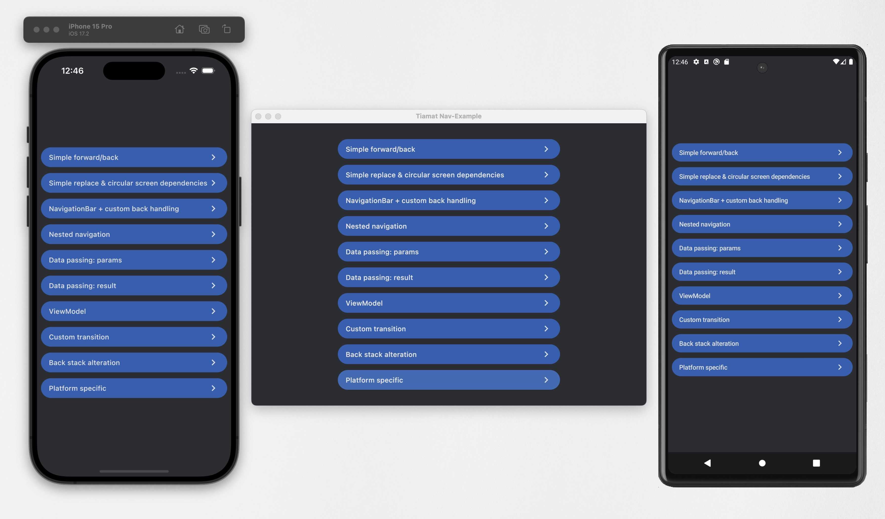

<h1 align="center">Tiamat</h1>
<h2 align="center">Compose multiplatform navigation library</h2>

<p align="center">
    <a target="_blank" href="https://github.com/ComposeGears/Tiamat/stargazers"></a>
    <a href="https://github.com/ComposeGears/Tiamat/network"></a>
    <a target="_blank" href="https://github.com/ComposeGears/Tiamat/blob/main/LICENSE"></a>
   <a target="_blank" href="https://central.sonatype.com/artifact/io.github.composegears/tiamat"></img></a>
</p>



Add the dependency below to your **module**'s `build.gradle.kts` file:
#### Android only
```kotlin
dependencies {
   implementation("io.github.composegears:tiamat:$version")
}
```

#### Multiplatform
```kotlin
sourceSets {
    commonMain.dependencies {
        implementation("io.github.composegears:tiamat:$version")
    }
}
```

Why Tiamat?
-----------

- Code generation free
- Pure compose
- Support nested navigation
- Support back-stack alteration (+deep-links)
- Easy to use
- Allow to pass ANY types as data, even lambdas (!under small condition)
- Customizable transitions
- No lifecycle. Just use compose DisposableEffect.

Setup
-----

1) Define your screens in one of 3 available ways:

   - chaotic good (screen name eq to value name)

       ```kotlin
       val Screen by navDestination<Unit> {
           // content
       }
       ```
   - chaotic neutral
       ```kotlin
    
       val Screen = NavDestination<Unit>("ScreenName") {
           // content
       }
       ```
   - chaotic evil
       ```kotlin
       object Screen : NavDestination<Unit> {
           override val name: String = "ScreenName"
    
           @Composable
           override fun NavDestinationScope<Unit>.Content() {
               // content
           }
    
       }
       ```
2) Create navController
    ```kotlin
     val navController = rememberNavController(
        startDestination = Screen,
        destinations = arrayOf(
            Screen,
            AnotherScreen,
            // ...
        )
     )
    ```
3) Setup navigation
    ```kotlin
    Navigation(navController)
    ```
4) Navigate
    ```kotlin
    val Screen by navDestination<Unit> {
        val navController = navController()
        Column{
            Text("Screen")
            Button(onClick = {
                navController.navigate(AnotherScreen)
            }){
                Text("Navigate")
            }
        }
    }
   ```

see example: [App.kt](example/composeApp/src/commonMain/kotlin/App.kt#L16)

Overview
--------
### Screen

The screens in `Tiamat` should be an entities (similar to composable functions)

the `Args` generic define the type of data, acceptable by screen as `input parameters` in the `NavController:navigate` fun

```kotlin
val RootScreen by navDestination<Unit> {
    // ...
    val nc = navController()
    // ...
    nc.navigate(DataScreen, DataScreenArgs(1))
    // ...
}

data class DataScreenArgs(val t: Int)

val DataScreen by navDestination<DataScreenArgs> {
    val args = navArgs()
}

```
----
The screen content scoped in `NavDestinationScope<Args>`

The scope provides a number of composable functions:

- `navController` - provides current NavController to navigate back/further
- `navArgs` - the arguments provided to this screen by `NavControllr:navigate(screen, args)` fun
- `navArgsOrNull` - same as `navArgs` but provides `null` if there is no data passed or if it was lost
- `navResult` - provide the data passed to `NavControllr:back(screen, navResult)` as result
- `rememberViewModel` - create or provide view model scoped(linked) to current screen

### NavController

You may create NavController using `rememberNavController` function:

```kotlin
fun rememberNavController(
    key: Any? = null,
    storageMode: StorageMode? = null,
    startDestination: NavDestination<*>? = null,
    destinations: Array<NavDestination<*>>
)
```

and display as part of any composable function
```kotlin
@Composable
fun content(){
    val navController = rememberNavController(...)
    Navigation(
        navController = navController,
        modifier = Modifier.fillMaxSize().systemBarsPadding()
    )
}
```

NavController will keep the screens data, view models, and states during navigation

> [!IMPORTANT]
> The data may be cleared by system (eg: Android may clear memory)
> 
> Upon restoration state there is few cases depend on `storageMode`

### Storage mode

- `null` - will take parent NavController mode or `ResetOnDataLoss` for root controller
- `StorageMode.Savable` - will store data in `savable` storage (eg: Android -> Bundle) 
> [!IMPORTANT]
> Only 'Savable' types of params & args will be available to use
>
> eg: Android - Parcelable + any bundlable primitives
- `StorageMode.ResetOnDataLoss` - store data in memory, allow to use any types of args & params (including lambdas). Reset nav controller upon data loss
- `StorageMode.IgnoreDataLoss` - store data in memory, allow to use any types of args & params (including lambdas). Restore nav back stack, ignore data loss

### Known limitations
 
> [!IMPORTANT] 
>  `Type checking has run into a recursive problem. Easiest workaround: specify types of your declarations explicitly` ide error.
> 
> 
> ```kotlin
> val SomeScreen1 by navDestination<Unit> {
>   val navController = navController()
>   Button(
>       onClick = { navController.navigate(SomeScreen2) }, // << error here
>       content = { Text("goScreen2") }
>   )
> }
> 
> val SomeScreen2 by navDestination<Unit> {
> val navController = navController()
>   Button(
>       onClick = { navController.navigate(SomeScreen1) }, // << or here
>       content = { Text("goScreen2") }
>   )
> }
> ```
> 
> Appears when it is circular initialization happen (Screen1 knows about Screen2 whot knows about Screen1 ...)
> 
> Solution: just define types of root(any in chain) screens explicitly 
> 
> ```kotlin
> val SomeScreen1: NavDestination<Unit> by navDestination { // ...
> ```

> [!IMPORTANT]
> No data exception
> 
> Using  `storageMode = StorageMode.DataStore.IgnoreDataLoss` in the `rememberNavController`
> 
> Within screens `val navArgs = navArgs()` 
> 
> May cause error in case internal data storage where cleared (eg: Android may release memory of activity)
> 
> Solution: there is safe version `val navArgs = navArgsOrNull()` 

Samples
-------

#### Simple back and forward navigation:

[1-simple-fb.webm](https://github.com/ComposeGears/Tiamat/assets/3141818/fbf88bc1-d366-4088-ad34-5ac9471d0b18)

#### Bottom bar navigation:

[2-bot-bar.webm](https://github.com/ComposeGears/Tiamat/assets/3141818/e541d4a4-119a-41d4-a1e5-26ef35dc7073)

#### Passing data to next screen:

[3-data-params.webm](https://github.com/ComposeGears/Tiamat/assets/3141818/9d151430-7fe9-47f6-83d2-9c58b700fe9a)

#### Passing data to previous screen:

[4-data-result.webm](https://github.com/ComposeGears/Tiamat/assets/3141818/9706867d-2c88-4d50-8c3d-d5d7d44aade3)

Custom transition:

[5-custom-transition.webm](https://github.com/ComposeGears/Tiamat/assets/3141818/9bfe1545-a321-495f-8d64-8d928746bc81)

### Examples code

- [SimpleForwardBack.kt](example/composeApp/src/commonMain/kotlin/content/examples/SimpleForwardBack.kt) - Simple back and forward navigation
- [SimpleReplace.kt](example/composeApp/src/commonMain/kotlin/content/examples/SimpleReplace.kt) - Example of `replace` navigation
- [NestedNavigation.kt](example/composeApp/src/commonMain/kotlin/content/examples/NestedNavigation.kt) - Nested nav controller interaction
- [Tabs.kt](example/composeApp/src/commonMain/kotlin/content/examples/Tabs.kt) - Bottom navigation example
- [DataPassingParams.kt](example/composeApp/src/commonMain/kotlin/content/examples/DataPassingParams.kt) - How to pass data to next screen
- [DataPassingResult.kt](example/composeApp/src/commonMain/kotlin/content/examples/DataPassingResult.kt) - How to provide result
- [CustomTransition.kt](example/composeApp/src/commonMain/kotlin/content/examples/CustomTransition.kt) - Custom animations/transition
- [BackStackAlteration.kt](example/composeApp/src/commonMain/kotlin/content/examples/BackStackAlteration.kt) - Alteration(modification) of backstack (deeplinks)
- [ViewModels.kt](example/composeApp/src/commonMain/kotlin/content/examples/ViewModels.kt) - ViewModels usage

### Run/Build sample

Android: `./gradlew example:composeApp:assembleDebug`

Desktop: `./gradlew example:composeApp:run`

iOs: run XCode project or else use [KMM](https://plugins.jetbrains.com/plugin/14936-kotlin-multiplatform-mobile) plugin iOs target


# License
```xml
Developed by ComposeGears 2024

Licensed under the Apache License, Version 2.0 (the "License");
you may not use this file except in compliance with the License.
You may obtain a copy of the License at

   http://www.apache.org/licenses/LICENSE-2.0

Unless required by applicable law or agreed to in writing, software
distributed under the License is distributed on an "AS IS" BASIS,
WITHOUT WARRANTIES OR CONDITIONS OF ANY KIND, either express or implied.
See the License for the specific language governing permissions and
limitations under the License.
```
